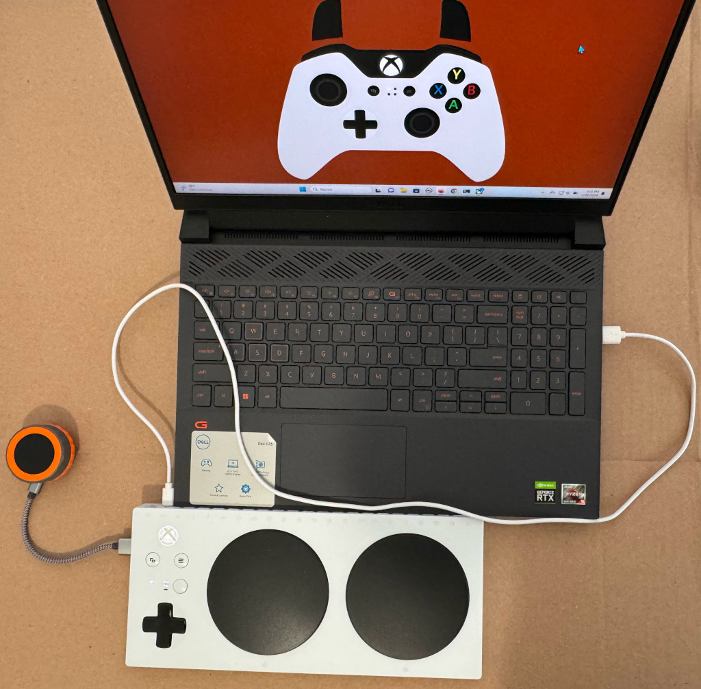
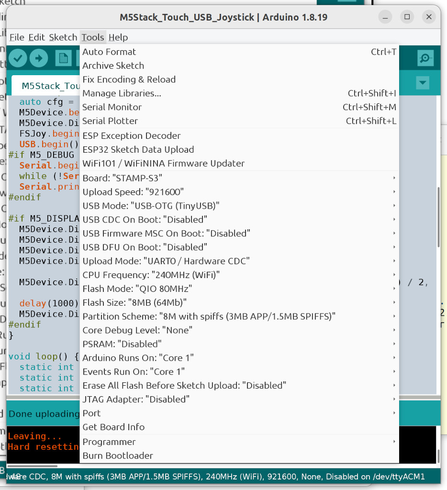
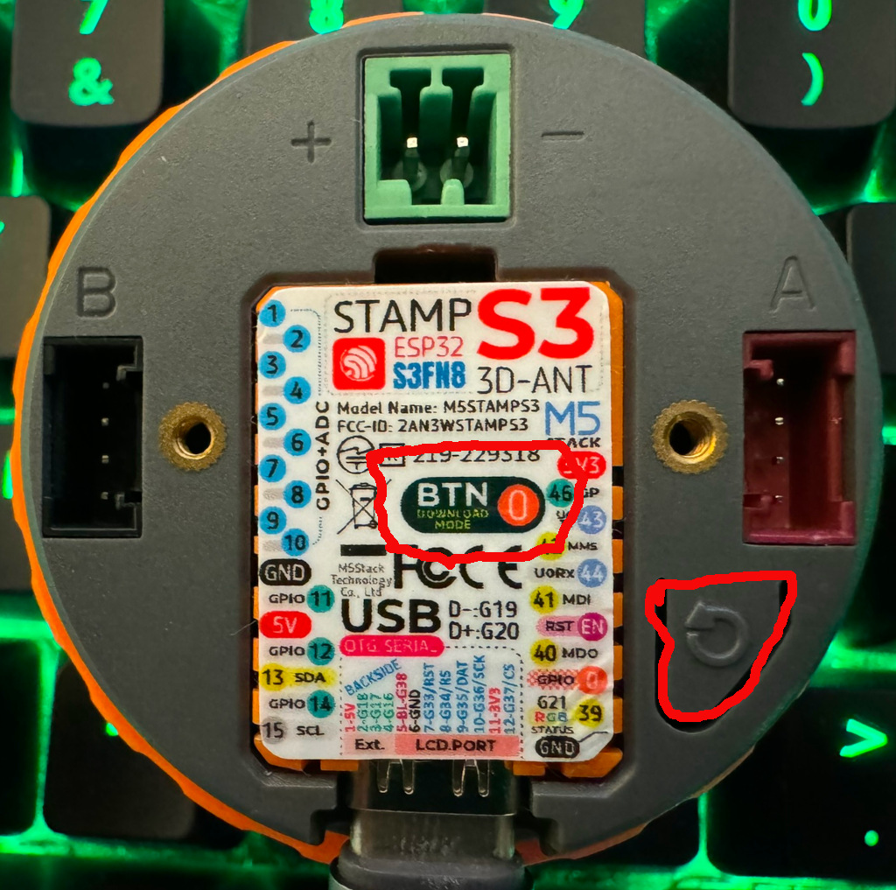

# M5Stack Dial Capacitive Touch USB Joystick

The M5Dial USB joystick can be used with the Xbox Adaptive Controller (XAC) as
well as Windows, MacOS, Linux, and other devices that accept USB HID joysticks.

The XAC provides at most 100 mA on its USB host ports unless it is plugged into
a 5V 2A power supply. Keeping the backlight brightness low ensures the M5Dial
draws less than 100 mA.

Tested using Arduino IDE 1.8.19 and [M5Stack Dial](https://docs.m5stack.com/en/core/M5Dial).

## Dependencies

Install the following libraries using the Arduino IDE Library Manager.

* "M5Dial" by M5Stack
* "M5Unified" by M5Stack
* "M5GFX" by M5Stack

The USB joystick library is from
https://github.com/esp32beans/ESP32_flight_stick. Download the library as a
ZIP file then install it using the Arduino IDE "Add .ZIP Library" option.

## Arduino IDE Build options for M5Stack Dial

Note the Board type is STAMP-S3. There is no M5Stack Dial option but the
Dial is built around a Stamp-S3 board.

To get the Dial into bootload mode, press and hold the BTN0 button at the
middle of the Dial then press and release the RESET button on the right side.
Then release BTN0. On other ESP32 boards the BTN0 button is usually labeled the
BOOT button.  The colorful label covers BTN0 but the button can be pressed
without removing the label.

